# Game Of Life About
My replica of the great Conway's Game Of Life

## Project specifications

### PC
This project has been written on Qt 5.11.1-2 and assembled on MinGW_32 
and MSVC_64 bit compilers for PC. 
PC version has full functionality(system of generations, mixing colors of generations,
map resizing, backgroung changing, different windows and many other cool stuff).

### Android
Also there is build for Android ARM v7-A and x86 processors on phones compiled on GCC 4.9.
For android assembly you will need to install Android JDK, Android SDK and Android NDK, write it's system and Qt paths.

If you want to test your app on virtual device -> download on SDK manager suitable platform and virtual device image with Android Emulator.

But if you decided to test your app on real device u'll need to download on SDK manager platform and install ADB driver for your device.
Of course if you have ancient device, like me, you will be able to download not working driver for the first time).

I've tested 2 ways and they perfectly working, but virtual device little bit laggy.

Important: version of Android NDK should be exactly r10e, otherwise u'll spend a many days not understanding what is wrong with your NDK, like it was with me!!!
So, just use Android NDK ver. r10e and all will be okay!

So, i don't think that it's all issues for Android, 'cause 6 months have passed since the writing last line of code of the project 
and much water has flowed from that moment. All i remember that Android had a lot of different problem;)
And yeah, Android has shortened functionality and if you'll puzzle out, I'll gladly accept your investments.

## Trip by folders
"GameOfLife" --> main folder with project and it's files inside
"GameofLife-release-MINGW32" --> full release project inside for Win x32 bit
"GameOfLife-Android-BareBones-solution" --> Qt project with shortened functionality for Android
"Screenshots" --> folder with screenshots below
and different builds(carefully, they are lot including Qt libs).

# Screenshots

## Game GUI on PC
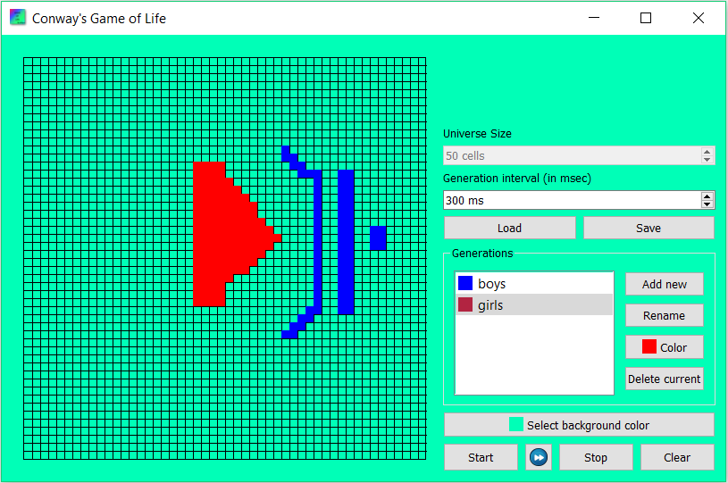
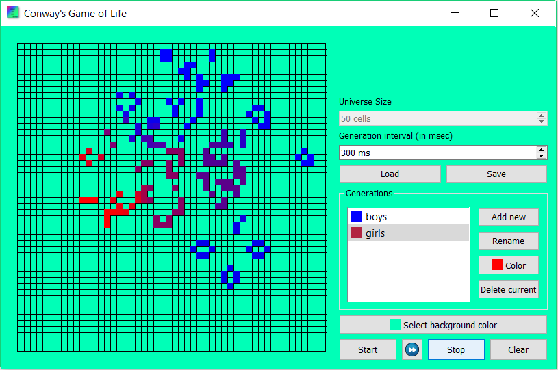
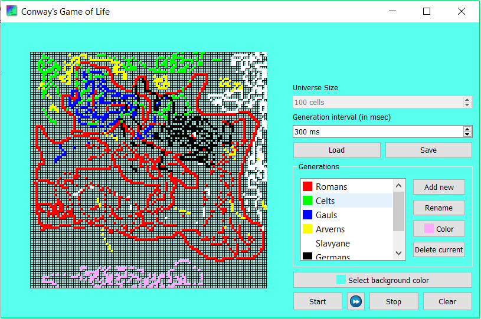
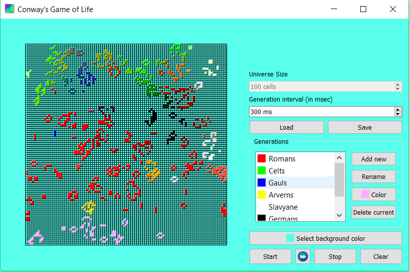
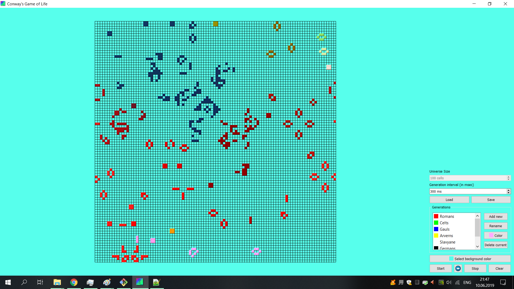

## Android
### Look
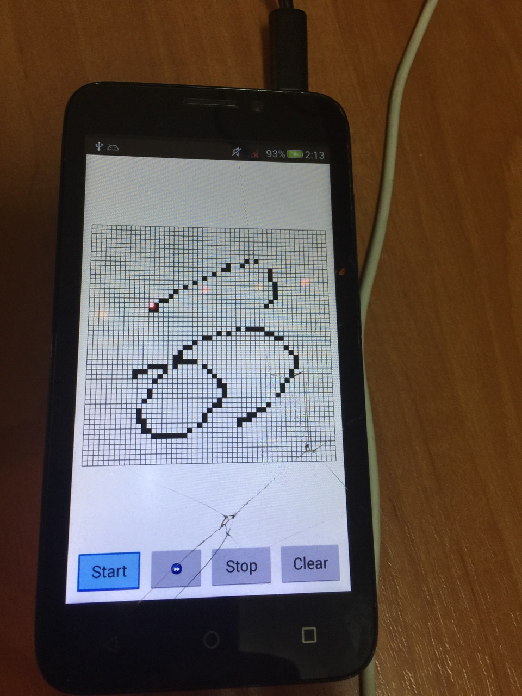

### Android emulator
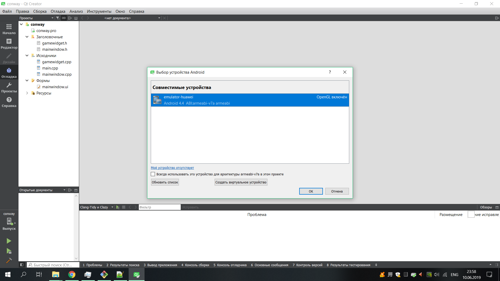

### Android SDK manager on Qt
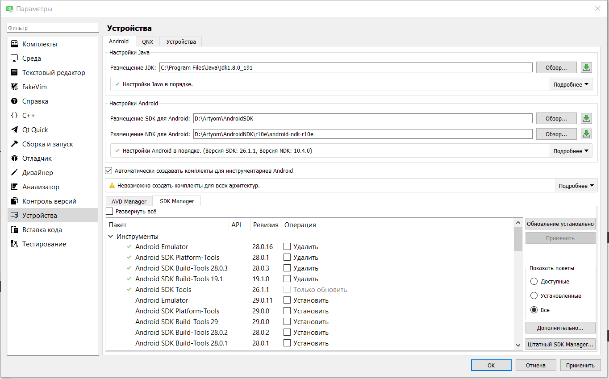

### Android ADB
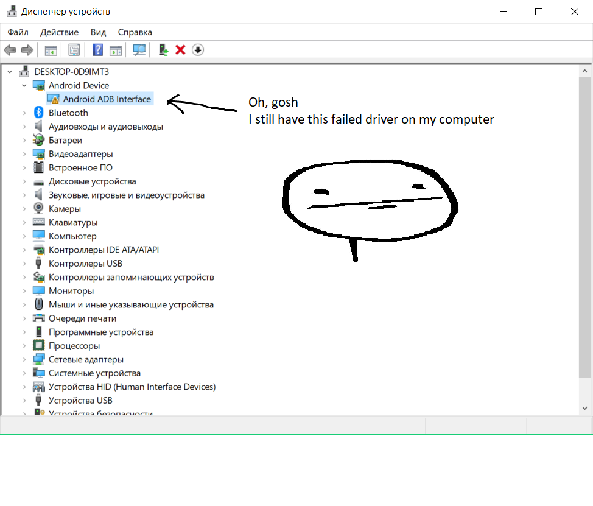

## Some Windows Looks
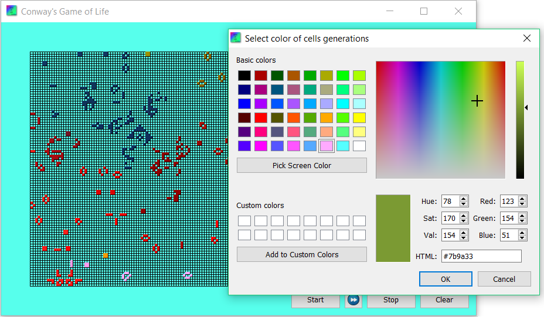
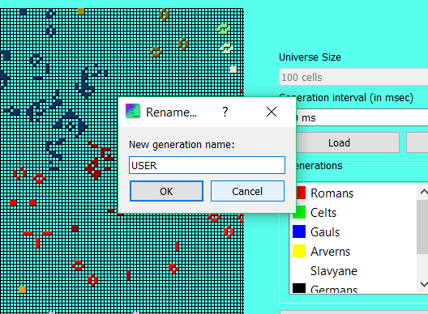
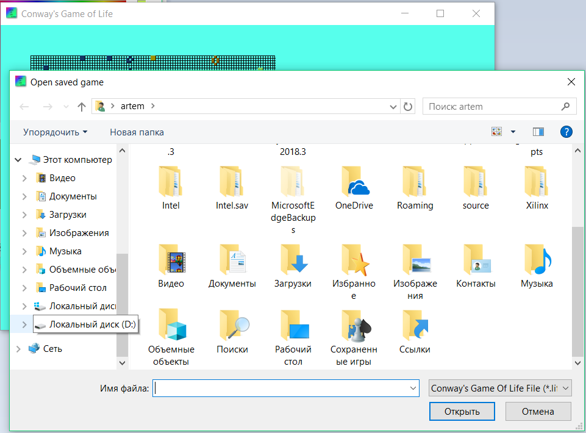

# ADS
So, if you want to gain Explanantory note with it's components, please contact here --> tsvirkoartem@gmail.com